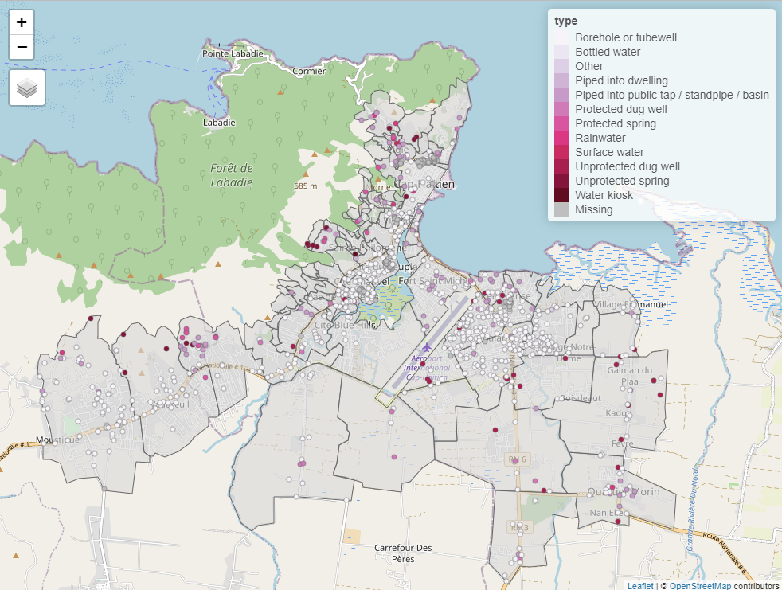

<!-- README.md is generated from README.Rmd. Please edit that file -->

```{r, include = FALSE}
knitr::opts_chunk$set(
  collapse = TRUE,
  comment = "#>",
  fig.path = "man/figures/README-",
  out.width = "100%",
  message = FALSE,
  warning = FALSE,
  fig.retina = 2,
  fig.align = 'center'
)

library(tidyverse)
library(sf)
library(tmap)
library(cbssuitabilityhaiti)
```

# cbssuitabilityhaiti

<!-- badges: start -->

[](ZENODO_DOI_URL)
[](https://github.com/openwashdata/cbssuitabilityhaiti/actions/workflows/R-CMD-check.yaml)

<!-- badges: end -->

The goal of `cbssuitabiility` is to provide datasets for research and
planning of water and solid waste management in Cap Haïtien, Haiti. This
package combines datasets collected as part of two different projects.
The package includes geospatial data about the locations of water access
points and data from a sanitation zoning report for the municipality of
Cap Haïtien.

|                    |
|:-------------------|
| DATA VISUALIZATION |

## Installation

You can install the development version of cbssuitabilityhaiti from
[GitHub](https://github.com/) with:

```{r installation, eval=FALSE, echo=TRUE}
# install.packages("devtools")
devtools::install_github("openwashdata/cbssuitabilityhaiti")
```

Alternatively, you can download the individual datasets as a CSV or XLSX
file from the table below.

```{r, echo=FALSE}

extdata_path <- "https://github.com/openwashdata/cbssuitabilityhaiti/raw/main/inst/extdata/"

read_csv("data-raw/dictionary.csv") |> 
  distinct(file_name) |> 
  mutate(file_name = str_remove(file_name, ".rda")) |> 
  rename(dataset = file_name) |> 
  mutate(
    CSV = paste0("[Download CSV](", extdata_path, dataset, ".csv)"),
    XLSX = paste0("[Download XLSX](", extdata_path, dataset, ".xlsx)")
  ) |> 
  knitr::kable()

```

# Projects

## Case Study: mWater in Haiti

(One sentence) Evaluating the potential of ........

### Description

(One to two short paragraphs) This Project focuses on determining
.......

### Research Question

(One to two questions)

### Data

Description of the Data. When/Where it was collected. For how long.

The package provides access to one data set.

```{r}
library(cbssuitabilityhaiti)
```

The `mwater` data set has `r ncol(mwater)` variables and
`r nrow(mwater)` observations. For an overview of the variable names,
see the following table.

```{r, eval=FALSE}
mwater
```

```{r, echo=FALSE}
readr::read_csv("data-raw/dictionary.csv") |> 
  dplyr::filter(file_name == "mwater.rda") |> 
  dplyr::select(variable_name:description) |> 
  knitr::kable()
```

A small visualisation of this data set

```{r, echo=FALSE}
#| label: fig-water-access-points
#| fig-cap: Locations of water access points in this dataset

qtm(mwater) +
  tm_graticules()
```

#### Source?

<https://www.mwater.co/projects/haiti>

## Projet Eau et Assainissement de l'USAID

Sanitation zoning assessment for the Cap Haïtien, Haiti region.

### Description

The study, based on three basic criteria (physical, urban
characteristics and socioeconomic constraints of the zones), divides the
Cap-Haïtien metropolitan area into homogeneous zones in order to propose
adapted sanitation solutions for each zone based on a set of predefined
criteria.

### Data

This data includes data from a sanitation zoning report done for the
city of Cap Haïtien, Haiti in 2022. Additionally, it contains spatial
data about the neighborhoods of 5 different Haïtien cities. The
attribute table includes data on population density, socioeconomic
status, suitability of pit latrines, and suggested sewage construction
priority zones.

These data were developed under the USAID Water and Sanitation Project
in collaboration with the Cap-Haitian municipal government and DINEPA.
These data do not reflect the opinion of USAID or the US Government.

```{r}
library(cbssuitabilityhaiti)
```

The `okap` data set has `r ncol(okap)` variables and `r nrow(okap)`
observations. For an overview of the variable names, see the following
table.

```{r, eval=FALSE}
okap
```

```{r, echo=FALSE}
readr::read_csv("data-raw/dictionary.csv") |> 
  dplyr::filter(file_name == "okap.rda") |> 
  dplyr::select(variable_name:description) |> 
  knitr::kable()
```

```{r, echo=FALSE}
qtm(okap) +
  tm_graticules()
```

#### Source?

<https://data.humdata.org/dataset/cap-haitien-haiti-sanitation-zoning-assessment>

## Examples

This is a basic example which shows you how to use the data:

```{r example, eval=FALSE, echo=TRUE}
library(cbssuitabilityhaiti)
library(tidyverse)
library(sf)
library(tmap)


## create an interactive map for cap haitien

# set mapping mode to interactive ("view")
tmap_mode("view")

# create first map layer: neighborhood areas
tm_shape(filter(okap, cte == "ctecaphaitien")) +
  tm_borders() +
  tm_fill(alpha = 0.6) +
  # create second map layer: locations and type of the water points
  tm_shape(drop_na(st_join(mwater, okap), neighborho)) +
  tm_dots(col = "type", palette = "PuRd")
```

```{r, echo=FALSE, fig.cap="Screenshot of the an interactive map with OpenStreetMap layer."}

```

## License

Data are available as
[CC-BY](https://github.com/openwashdata/cbssuitability/blob/main/LICENSE.md).

## Citation

Please cite using:

```{r}
citation("cbssuitabilityhaiti")
```

## Additional data use information

Anyone interested in publishing the data:

-   World Bank flood extent data (`FLOOD_EXTENT_DATASET_NAME`) should be
    attributed with "Plan d'Élaboration propre basée sur les données de
    la Banque Mondiale: Inondation de Récurrence (5 ans / 25 ans / 100
    ans)"

-   Sanitation zoning assessment data (`okap`) should be attributed with
    "These data were developed under the USAID Water and Sanitation
    Project in collaboration with the Cap-Haitian municipal government
    and DINEPA. These data do not reflect the opinion of USAID or the US
    Government."
