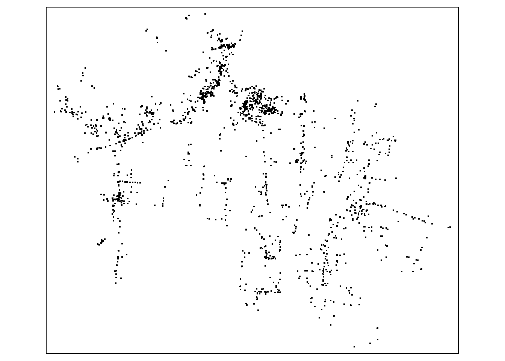

<!-- README.md is generated from README.Rmd. Please edit that file -->

# cbssuitabilityhaiti

<!-- badges: start -->

DOI R-CMD-Check

<!-- badges: end -->

# Overview

This packages combines data collected as part of ?????? conducted in
Haiti. The projects were supported by SOIL at ??????.

## Installation

You can install the development version of cbssuitabilityhaiti from
[GitHub](https://github.com/) with:

``` r
# install.packages("devtools")
devtools::install_github("openwashdata/cbssuitabilityhaiti")
```

Alternatively, you can download the individual datasets as a CSV or XLSX
file from the table below.

| dataset | CSV                                                                                                  | XLSX                                                                                                   |
|:--------|:-----------------------------------------------------------------------------------------------------|:-------------------------------------------------------------------------------------------------------|
| okap    | [Download CSV](https://github.com/openwashdata/cbssuitabilityhaiti/raw/main/inst/extdata/okap.csv)   | [Download XLSX](https://github.com/openwashdata/cbssuitabilityhaiti/raw/main/inst/extdata/okap.xlsx)   |
| mwater  | [Download CSV](https://github.com/openwashdata/cbssuitabilityhaiti/raw/main/inst/extdata/mwater.csv) | [Download XLSX](https://github.com/openwashdata/cbssuitabilityhaiti/raw/main/inst/extdata/mwater.xlsx) |

# Projects

## mWater

(One sentence) Evaluating the potential of ……..

### Description

(One to two short paragraphs) This Project focuses on determining …….

### Research Question

(One to two questions)

### Data

Description of the Data. When/Where it was collected. For how long.

The package provides access one data set.

``` r
library(cbssuitabilityhaiti)
```

The `mwater` data set has 7 variables and 1849 observations. For an
overview of the variable names, see the following table.

``` r
mwater
```

| variable_name | variable_type | description                                                                                  |
|:--------------|:--------------|:---------------------------------------------------------------------------------------------|
| latitude      | double        | Lattitude coordinate                                                                         |
| longitude     | double        | Longitude coordinate                                                                         |
| administra    | character     | Communal section- smallest administrative unit in Haiti                                      |
| type          | character     | Type of water access point                                                                   |
| date_added    | double        | Date water access point was added to mWater                                                  |
| datasets      | character     | Dataset in mWater that point is part of, including organizaiton that is responsible for data |
| geometry      | list          | Geospatial data of the different access points that were added to mWater                     |

A small visualisation of this data set



## Okap

(One sentence) Evaluating the potential of ……..

### Description

(One to two short paragraphs) This Project focuses on determining …….

### Research Question

(One to two questions)

### Data

Description of the Data. When/Where it was collected. For how long.

The package provides access one data set.

``` r
library(cbssuitabilityhaiti)
```

The `okap` data set has 13 variables and 198 observations. For an
overview of the variable names, see the following table.

``` r
okap
```

| variable_name | variable_type | description                                                                                                 |
|:--------------|:--------------|:------------------------------------------------------------------------------------------------------------|
| neighborho    | double        | Unique identifying number for each neighborhood unit                                                        |
| name          | character     | Name of each nieghborhood unit                                                                              |
| sup_km2       | double        | Area of neighborhood in square km                                                                           |
| cte           | character     | Name of commune (administrative unit in Haiti)                                                              |
| economy       | character     | Categorical socioeconomic status (low, medium)                                                              |
| sup_bati_km2  | double        | area of neihborhood covered by buildings in square kilometers                                               |
| density       | integer       | Categorical population density (least dense, somewhat dense, dense, very dense, most dense)                 |
| aptitude      | character     | suitability of the site for a wastewater treatment system                                                   |
| zoning        | character     | “group” if collective or grouped sanitation is possible in short term.                                      |
| latrine       | character     | Suggested pit latrine and septic allowance (allowed, not allowed)                                           |
| density_ra    | double        | Catgoriccal population density according to the description of the variable “density” (values from 1 to 5)  |
| economy_nu    | double        | Categotical socioeconomic status according to the description of the variable “economy” (1=low, 2 = medium) |
| geometry      | list          | Geospatial data of the neighborhood stored as a polygon                                                     |

A small visualisation of this data set


## Examples

This is a basic example which shows you how to use the data:

``` r
library(cbssuitabilityhaiti)
## basic example code
```

## License

Data are available as
[CC-BY](https://github.com/openwashdata/cbssuitability/blob/main/LICENSE.md).

## Citation

Please cite using:

``` r
citation("cbssuitabilityhaiti")
#> Um Paket 'cbssuitabilityhaiti' in Publikationen zu zitieren, nutzen Sie
#> bitte:
#> 
#>   Loos S, Lubeck-Schricker M, Kramer S (2023). _cbssuitabilityhaiti:
#>   The Package contains data from the Soil projects in Haiti_. R package
#>   version 0.0.0.9000.
#> 
#> Ein BibTeX-Eintrag für LaTeX-Benutzer ist
#> 
#>   @Manual{,
#>     title = {cbssuitabilityhaiti: The Package contains data from the Soil projects in Haiti},
#>     author = {Sebastian Camilo Loos and Maya Lubeck-Schricker and Sasha Kramer},
#>     year = {2023},
#>     note = {R package version 0.0.0.9000},
#>   }
```

## Additional data use information

Anyone interested in publishing the data:

- World Bank flood extent data (`mwater`) should be attributed with
  “Plan d’Élaboration propre basée sur les données de la Banque
  Mondiale: Inondation de Récurrence (5 ans / 25 ans / 100 ans)”

- Sanitation zoning assessment data (`okap`) should be attributed with
  “These data were developed under the USAID Water and Sanitation
  Project in collaboration with the Cap-Haitian municipal government and
  DINEPA. These data do not reflect the opinion of USAID or the US
  Government.”
