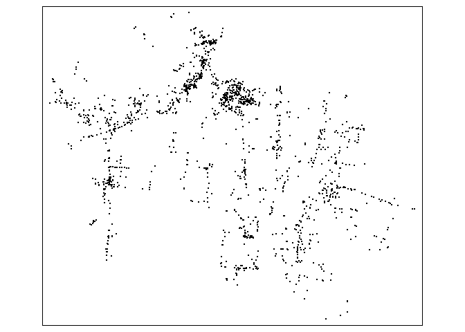
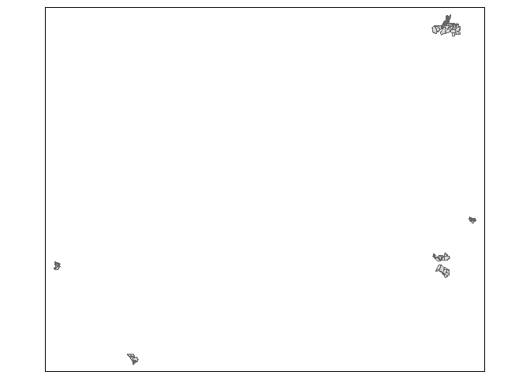

<!-- README.md is generated from README.Rmd. Please edit that file -->

# cbssuitabilityhaiti

<!-- badges: start -->

DOI R-CMD-Check <!-- badges: end -->

# Overview

This packages combines data collected as part of ?????? conducted in
Haiti. The projects were supported by SOIL at ??????.

## Installation

You can install the development version of cbssuitabilityhaiti from
[GitHub](https://github.com/) with:

``` r
# install.packages("devtools")
devtools::install_github("openwashdata/cbssuitabilityhaiti")
```

Alternatively, you can download the individual datasets as a CSV or XLSX
file from the table below.

| dataset | CSV                                                                                                  | XLSX                                                                                                   |
|:--------|:-----------------------------------------------------------------------------------------------------|:-------------------------------------------------------------------------------------------------------|
| okap    | [Download CSV](https://github.com/openwashdata/cbssuitabilityhaiti/raw/main/inst/extdata/okap.csv)   | [Download XLSX](https://github.com/openwashdata/cbssuitabilityhaiti/raw/main/inst/extdata/okap.xlsx)   |
| mwater  | [Download CSV](https://github.com/openwashdata/cbssuitabilityhaiti/raw/main/inst/extdata/mwater.csv) | [Download XLSX](https://github.com/openwashdata/cbssuitabilityhaiti/raw/main/inst/extdata/mwater.xlsx) |

# Projects

## mWater

(One sentence) Evaluating the potential of ……..

### Description

(One to two short paragraphs) This Project focuses on determining …….

### Research Question

(One to two questions)

### Data

Description of the Data. When/Where it was collected. For how long.

The package provides access one data set.

``` r
library(cbssuitabilityhaiti)
```

``` epoxy
The `mwater` data set has {ncol(mwater)} variables and {nrow(mwater)} observations. For an overview of the variable names, see the following table.  
```

``` r
mwater
```

| variable_name | variable_type | description |
|:--------------|:--------------|:------------|
| Latitude.o    | double        | NA          |
| Longitude     | double        | NA          |
| Administra    | character     | NA          |
| Type          | character     | NA          |
| Date.added    | character     | NA          |
| Datasets..    | character     | NA          |
| geometry      | list          | NA          |

A small visualisation of this data set



## Okap

(One sentence) Evaluating the potential of ……..

### Description

(One to two short paragraphs) This Project focuses on determining …….

### Research Question

(One to two questions)

### Data

Description of the Data. When/Where it was collected. For how long.

The package provides access one data set.

``` r
library(cbssuitabilityhaiti)
```

``` epoxy
The `okap` data set has {ncol(okap)} variables and {nrow(okap)} observations. For an overview of the variable names, see the following table.  
```

``` r
okap
```

| variable_name | variable_type | description |
|:--------------|:--------------|:------------|
| neighborho    | double        | NA          |
| name          | character     | NA          |
| sup_km2       | double        | NA          |
| sector_id     | double        | NA          |
| cte           | character     | NA          |
| qlty_water    | double        | NA          |
| qty_water     | double        | NA          |
| health_car    | double        | NA          |
| schooling     | double        | NA          |
| transport     | double        | NA          |
| economy       | character     | NA          |
| ranking       | double        | NA          |
| sup_bati      | double        | NA          |
| density       | character     | NA          |
| aptitude      | character     | NA          |
| zoning        | character     | NA          |
| latrine       | character     | NA          |
| standing      | character     | NA          |
| density_ra    | double        | NA          |
| economy_nu    | double        | NA          |
| geometry      | list          | NA          |

A small visualisation of this data set



## Examples

This is a basic example which shows you how to use the data:

``` r
library(cbssuitabilityhaiti)
## basic example code
```
