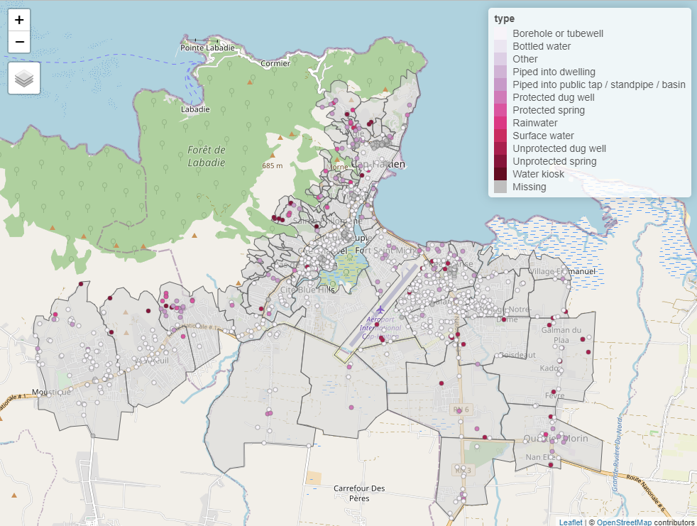

<!-- README.md is generated from README.Rmd. Please edit that file -->

# cbssuitabilityhaiti

<!-- badges: start -->

[](ZENODO_DOI_URL)
[](https://github.com/openwashdata/cbs%20suitabilityhaiti/actions/workflows/R-CMD-check.yaml)
[](https://creativecommons.org/licenses/by/4.0/)

<!-- badges: end -->

The goal of `cbssuitabiility` is to provide datasets for research and
planning of water and solid waste management in Cap Haïtien, Haiti. This
package combines datasets collected as part of two different projects.
The package includes geospatial data about the locations of water access
points and data from a sanitation zoning report for the municipality of
Cap Haïtien.

## Installation

You can install the development version of cbssuitabilityhaiti from
[GitHub](https://github.com/) with:

``` r
# install.packages("devtools")
devtools::install_github("openwashdata/cbssuitabilityhaiti")
```

Alternatively, you can download the individual datasets as a CSV or XLSX
file from the table below.

| dataset | CSV                                                                                                  | XLSX                                                                                                   |
|:--------|:-----------------------------------------------------------------------------------------------------|:-------------------------------------------------------------------------------------------------------|
| okap    | [Download CSV](https://github.com/openwashdata/cbssuitabilityhaiti/raw/main/inst/extdata/okap.csv)   | [Download XLSX](https://github.com/openwashdata/cbssuitabilityhaiti/raw/main/inst/extdata/okap.xlsx)   |
| mwater  | [Download CSV](https://github.com/openwashdata/cbssuitabilityhaiti/raw/main/inst/extdata/mwater.csv) | [Download XLSX](https://github.com/openwashdata/cbssuitabilityhaiti/raw/main/inst/extdata/mwater.xlsx) |

# Datasets

This data package has two datasets, `mwater` and `okap`.

## mwater

Water point data for the city of Cap Haitien, Haiti. The data collection
and characterization was done between 2016 and 2022.

``` r
library(cbssuitabilityhaiti)
```

The `mwater` data set has 7 variables and 1849 observations. For an
overview of the variable names, see the following table.

``` r
mwater 
```

| variable_name | variable_type | description                                                                                  |
|:--------------|:--------------|:---------------------------------------------------------------------------------------------|
| latitude      | double        | Lattitude coordinate                                                                         |
| longitude     | double        | Longitude coordinate                                                                         |
| administra    | character     | Communal section- smallest administrative unit in Haiti                                      |
| type          | character     | Type of water access point                                                                   |
| date_added    | double        | Date water access point was added to mWater                                                  |
| datasets      | character     | Dataset in mWater that point is part of, including organizaiton that is responsible for data |
| geometry      | list          | Geospatial data of the different access points that were added to mWater                     |

Below is a map of the water points in this dataset.

<div class="figure" style="text-align: center">


<p class="caption">
Locations of water access points in this dataset
</p>

</div>

## Projet Eau et Assainissement de l’USAID

Sanitation zoning assessment for the Cap Haïtien, Haiti region.

### Description

The study, based on three basic criteria (physical, urban
characteristics and socioeconomic constraints of the zones), divides the
Cap-Haïtien metropolitan area into homogeneous zones in order to propose
adapted sanitation solutions for each zone based on a set of predefined
criteria.

### Data

This data includes data from a sanitation zoning report done for the
city of Cap Haïtien, Haiti in 2022. Additionally, it contains spatial
data about the neighborhoods of 5 different Haïtien cities. The
attribute table includes data on population density, socioeconomic
status, suitability of pit latrines, and suggested sewage construction
priority zones.

These data were developed under the USAID Water and Sanitation Project
in collaboration with the Cap-Haitian municipal government and DINEPA.
These data do not reflect the opinion of USAID or the US Government.

``` r
library(cbssuitabilityhaiti)
```

The `okap` data set has 13 variables and 198 observations. For an
overview of the variable names, see the following table.

``` r
okap
```

| variable_name | variable_type | description                                                                                                 |
|:--------------|:--------------|:------------------------------------------------------------------------------------------------------------|
| neighborho    | double        | Unique identifying number for each neighborhood unit                                                        |
| name          | character     | Name of each nieghborhood unit                                                                              |
| sup_km2       | double        | Area of neighborhood in square km                                                                           |
| cte           | character     | Name of commune (administrative unit in Haiti)                                                              |
| economy       | character     | Categorical socioeconomic status (low, medium)                                                              |
| sup_bati_km2  | double        | area of neihborhood covered by buildings in square kilometers                                               |
| density       | integer       | Categorical population density (least dense, somewhat dense, dense, very dense, most dense)                 |
| aptitude      | character     | suitability of the site for a wastewater treatment system                                                   |
| zoning        | character     | “group” if collective or grouped sanitation is possible in short term.                                      |
| latrine       | character     | Suggested pit latrine and septic allowance (allowed, not allowed)                                           |
| density_ra    | double        | Catgoriccal population density according to the description of the variable “density” (values from 1 to 5)  |
| economy_nu    | double        | Categotical socioeconomic status according to the description of the variable “economy” (1=low, 2 = medium) |
| geometry      | list          | Geospatial data of the neighborhood stored as a polygon                                                     |


#### Source

<https://data.humdata.org/dataset/cap-haitien-haiti-sanitation-zoning-assessment>

## Examples

The code below is an example which shows how you could use the data to
prepare a map in R. Find this and more examples in the [prepared
examples
article](https://openwashdata.github.io/cbssuitabilityhaiti/articles/examples.html)
(`vignette("examples")`).

``` r

library(cbssuitabilityhaiti)
library(tidyverse)
library(sf)
library(tmap)


## create an interactive map for cap haitien

# set mapping mode to interactive ("view")
tmap_mode("view")

# create first map layer: neighborhood areas
tm_shape(filter(okap, cte == "ctecaphaitien")) +
  tm_borders() +
  tm_fill(alpha = 0.6) +
  # create second map layer: locations and type of the water points
  tm_shape(drop_na(st_join(mwater, okap), neighborho)) +
  tm_dots(col = "type", palette = "PuRd")
```

<div class="figure" style="text-align: center">


<p class="caption">
Screenshot of the an interactive map with OpenStreetMap layer.
</p>

</div>

## License

Data are available as
[CC-BY](https://github.com/openwashdata/cbssuitability/blob/main/LICENSE.md).

## Citation

Please cite using:

``` r
citation("cbssuitabilityhaiti")
#> To cite package 'cbssuitabilityhaiti' in publications use:
#> 
#>   Loos S, Lubeck-Schricker M, Kramer S (????). _cbssuitabilityhaiti:
#>   The Package contains data from the Soil projects in Haiti_. R package
#>   version 0.0.0.9000.
#> 
#> A BibTeX entry for LaTeX users is
#> 
#>   @Manual{,
#>     title = {cbssuitabilityhaiti: The Package contains data from the Soil projects in Haiti},
#>     author = {Sebastian Camilo Loos and Maya Lubeck-Schricker and Sasha Kramer},
#>     note = {R package version 0.0.0.9000},
#>   }
```

## Additional data use information

Anyone interested in publishing the data:

- Sanitation zoning assessment data (`okap`) should be attributed with
  “These data were developed under the USAID Water and Sanitation
  Project in collaboration with the Cap-Haitian municipal government and
  DINEPA. These data do not reflect the opinion of USAID or the US
  Government.”
