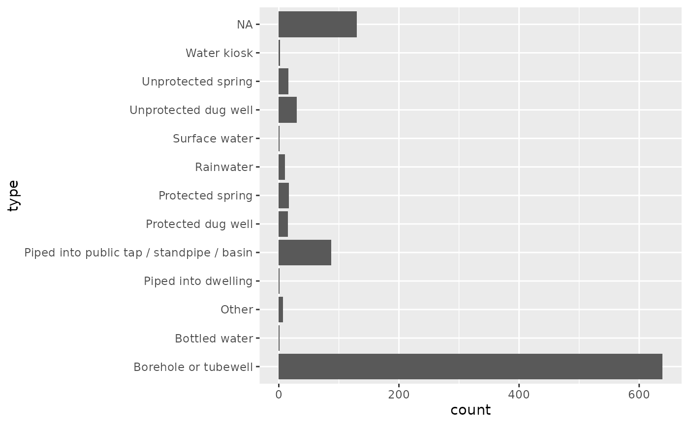
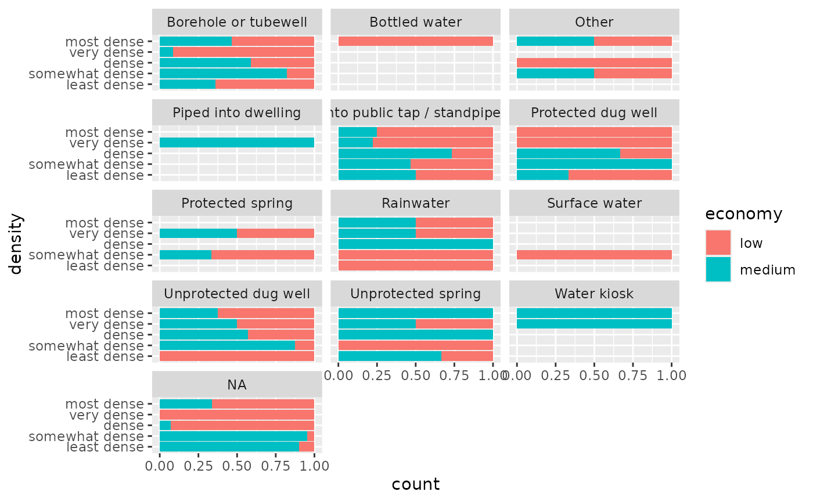
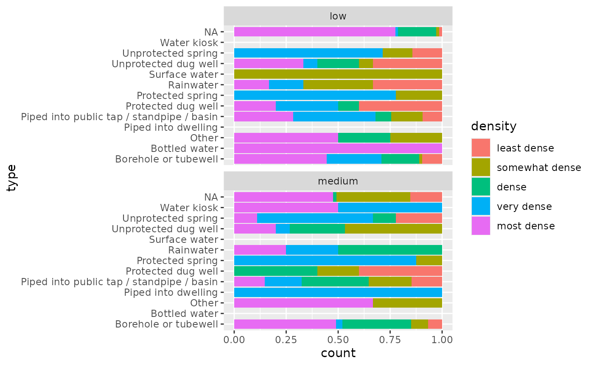

# Examples

## Load Packages

``` r

library(cbssuitabilityhaiti)
library(tidyverse)
library(here)
library(sf)
library(tmap)
library(spData)
library(janitor)
library(devtools)
```

## Background

Haiti is a island state in the Caribbean sea. It has four administrative
levels where the 3rd level is used to emphasize the data through out
this article. The 3rd administrative level contains 134 areas. For this
article the extended area around Cap Haïtien and l’Acul-du-Nord has been
explored as depicted in @fig-northern-area.







## Used datasets

### `okap`

``` r

as_tibble(okap)
#> # A tibble: 198 × 13
#>    neighborho name    sup_km2 cte   economy sup_bati_km2 density aptitude zoning
#>         <dbl> <chr>     <dbl> <chr> <chr>          <dbl> <fct>   <chr>    <chr> 
#>  1         10 Blue H…   2.47  ctec… low            0.518 most d… bad      NA    
#>  2         21 Caréna…   0.961 ctec… medium         0.051 somewh… good     group 
#>  3         37 Anba S…   0.390 ctec… low            0.16  very d… bad      NA    
#>  4         53 Centre…   0.268 ctem… NA            NA     NA      bad      NA    
#>  5         60 Artibo…   0.578 ctem… NA            NA     NA      bad      NA    
#>  6        279 Charri…   0.414 ctec… low            0.139 very d… bad      NA    
#>  7        187 Villag…   0.599 ctec… low            0.019 least … bad      NA    
#>  8        198 Quarti…   2.95  ctec… medium         0.127 dense   bad      NA    
#>  9        238 Bel Air   0.693 ctec… medium         0.197 very d… bad      group 
#> 10        282 Babiole   0.928 ctec… low            0.357 most d… bad      NA    
#> # ℹ 188 more rows
#> # ℹ 4 more variables: latrine <chr>, density_ra <dbl>, economy_nu <dbl>,
#> #   geometry <POLYGON [m]>
```

### `mwater`

``` r

as_tibble(mwater)
#> # A tibble: 1,849 × 7
#>    latitude longitude administra              type  date_added          datasets
#>       <dbl>     <dbl> <chr>                   <chr> <dttm>              <chr>   
#>  1     19.7     -72.2 3e Section Genipailler… Bore… 2020-07-28 02:34:00 Inventa…
#>  2     19.7     -72.2 3e Section Genipailler… Prot… 2016-10-25 10:57:00 FRAPE (…
#>  3     19.7     -72.2 3e Section Genipailler… Bore… 2016-10-27 15:15:00 FRAPE (…
#>  4     19.7     -72.2 3e Section Genipailler… Bore… 2016-10-25 10:57:00 FRAPE (…
#>  5     19.7     -72.2 3e Section Genipailler… Bore… 2020-07-28 02:34:00 Inventa…
#>  6     19.7     -72.2 3e Section Genipailler… Other 2021-09-30 19:37:00 NA      
#>  7     19.7     -72.2 3e Section Genipailler… Prot… 2016-10-27 15:15:00 FRAPE (…
#>  8     19.7     -72.2 3e Section Genipailler… Bore… 2016-10-25 10:57:00 FRAPE (…
#>  9     19.7     -72.2 1re Section Basse Plai… Bore… 2020-07-28 02:34:00 Inventa…
#> 10     19.7     -72.2 3e Section Petit Anse,… Bore… 2020-07-28 02:34:00 Inventa…
#> # ℹ 1,839 more rows
#> # ℹ 1 more variable: geometry <MULTIPOINT [m]>
```

### Haiti 3rd level administrative areas `haiti_adm3`

``` r

as_tibble(haiti_adm3)
#> # A tibble: 134 × 16
#>     ID_0 ISO   NAME_0  ID_1 NAME_1  ID_2 NAME_2   ID_3 NAME_3 CCN_3 CCA_3 TYPE_3
#>    <dbl> <chr> <chr>  <dbl> <chr>  <dbl> <chr>   <dbl> <chr>  <dbl> <chr> <chr> 
#>  1    99 HTI   Haiti      1 Centre     1 Cerca …     1 Cerca…     0 NA    Commu…
#>  2    99 HTI   Haiti      1 Centre     1 Cerca …     2 Thoma…     0 NA    Commu…
#>  3    99 HTI   Haiti      1 Centre     2 Hinche      3 Cerca…     0 NA    Commu…
#>  4    99 HTI   Haiti      1 Centre     2 Hinche      4 Hinche     0 NA    Commu…
#>  5    99 HTI   Haiti      1 Centre     2 Hinche      5 Maïss…     0 NA    Commu…
#>  6    99 HTI   Haiti      1 Centre     2 Hinche      6 Thomo…     0 NA    Commu…
#>  7    99 HTI   Haiti      1 Centre     3 Lascah…     7 Bella…     0 NA    Commu…
#>  8    99 HTI   Haiti      1 Centre     3 Lascah…     8 Lasca…     0 NA    Commu…
#>  9    99 HTI   Haiti      1 Centre     3 Lascah…     9 Savan…     0 NA    Commu…
#> 10    99 HTI   Haiti      1 Centre     4 Mireba…    10 Bouca…     0 NA    Commu…
#> # ℹ 124 more rows
#> # ℹ 4 more variables: ENGTYPE_3 <chr>, NL_NAME_3 <chr>, VARNAME_3 <chr>,
#> #   geometry <MULTIPOLYGON [°]>
```
